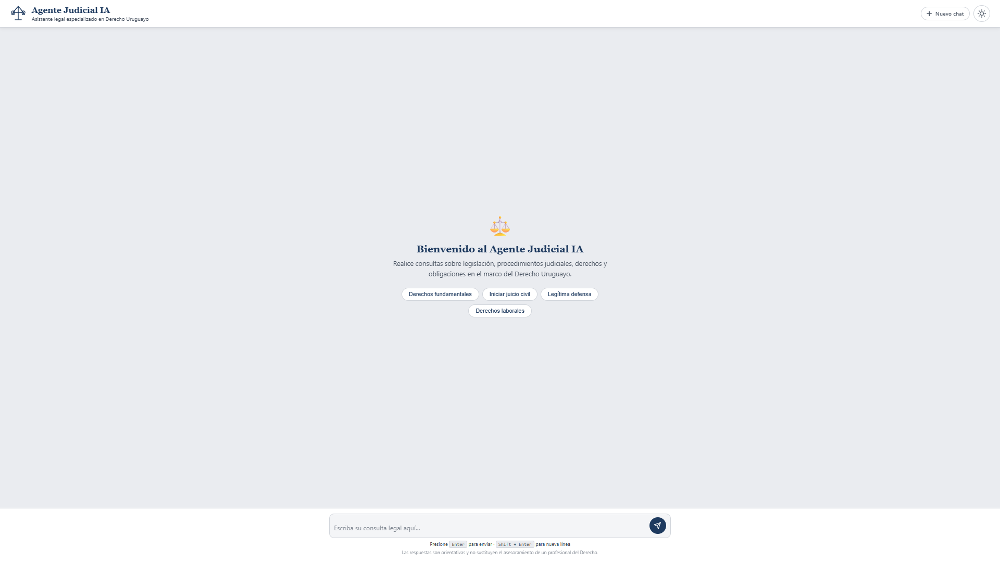
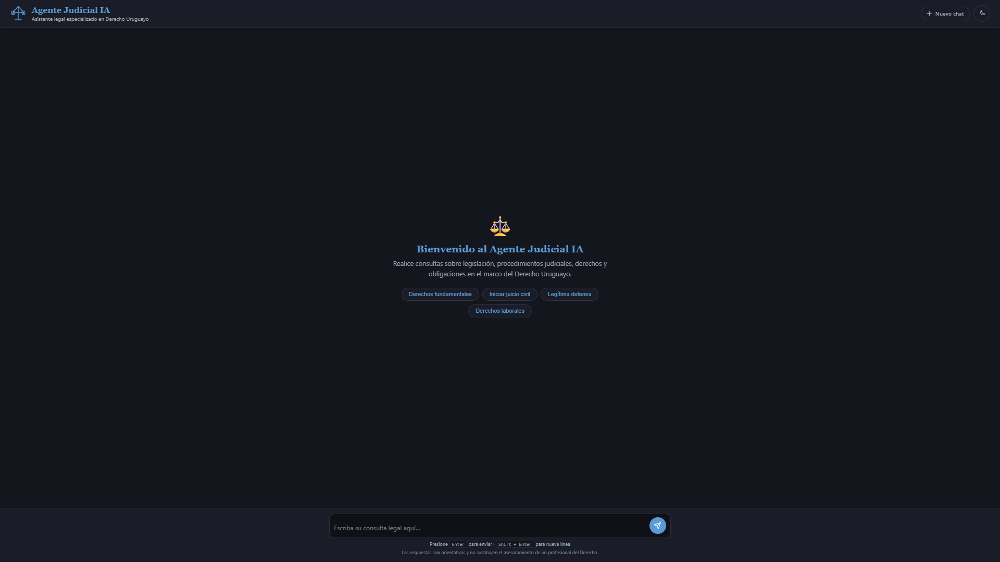

# Agente Judicial IA — Derecho Uruguayo

Asistente legal virtual impulsado por inteligencia artificial, especializado en el Derecho de la República Oriental del Uruguay. Permite realizar consultas sobre legislación, procedimientos judiciales, derechos y obligaciones de forma conversacional.

---

## Preview

| Modo Claro | Modo Oscuro |
|:-----------:|:-----------:|
|  |  |

---

## Características

- **Chat conversacional con IA** — Interfaz estilo chat que mantiene el contexto de la conversación (hasta 20 intercambios).
- **Especializado en Derecho Uruguayo** — System prompt diseñado para responder exclusivamente sobre legislación, normativa y procedimientos del Uruguay, citando leyes y artículos relevantes.
- **Modo oscuro / claro** — Toggle de tema con persistencia en `localStorage` y detección automática de preferencia del sistema operativo.
- **Sugerencias rápidas** — Botones de consulta predefinidos para explorar funcionalidades sin escribir.
- **Markdown → HTML** — Las respuestas del modelo se renderizan con negritas, viñetas y listas numeradas.
- **Manejo de errores robusto** — Mensajes claros ante errores de red, rate limiting o respuestas vacías.
- **Protección XSS** — El input del usuario se escapa antes de insertarse en el DOM.
- **Responsive** — Diseño adaptable a escritorio y dispositivos móviles.
- **Zero dependencies** — Sin frameworks ni librerías externas; HTML, CSS y JavaScript vanilla.

---

## Arquitectura

```
├── index.html            # Estructura del chat, header y footer
├── css/
│   ├── base.css          # Variables CSS (tokens), reset y estilos globales
│   ├── header.css        # Estilos del header, logo y navegación
│   ├── chat.css          # Mensajes, burbujas y pantalla de bienvenida
│   ├── input.css         # Campo de entrada y botón de envío
│   └── animations.css    # Transiciones y animaciones
├── js/
│   ├── config.js         # API key, URL del endpoint y modelo
│   ├── prompt.js         # System prompt con reglas y áreas de conocimiento
│   ├── ui.js             # Referencias al DOM, estado global y helpers de UI
│   ├── api.js            # Comunicación con la API de Groq
│   ├── chat.js           # Lógica principal: envío, validación y eventos
│   └── theme.js          # Toggle de tema oscuro/claro con persistencia
└── README.md
```

Los archivos JS se cargan en orden de dependencia: `config → prompt → ui → api → chat → theme`.

---

## Tecnologías

| Capa | Tecnología |
|------|-----------|
| **Frontend** | HTML5, CSS3 (Custom Properties, Flexbox), JavaScript ES6+ (vanilla) |
| **IA / LLM** | [Groq API](https://groq.com/) con modelo **LLaMA 3.3 70B Versatile** |
| **Diseño** | Sistema de tokens CSS con soporte de tema claro/oscuro, SVG inline |

---

## Configuración

Para cambiar el modelo, proveedor o API key, editar `js/config.js`:

```js
const API_KEY = 'tu_api_key_aqui';
const API_URL = 'https://api.groq.com/openai/v1/chat/completions';
const MODEL   = 'llama-3.3-70b-versatile';
```

Para modificar el comportamiento del asistente (tono, reglas, áreas de conocimiento), editar el prompt en `js/prompt.js`.

---

## Áreas de conocimiento

El agente está entrenado contextualmente para responder sobre:

- Constitución de la República (1967 y reformas)
- Código Civil y Código de Comercio
- Código Penal y Código del Proceso Penal (Ley 19.293)
- Código General del Proceso (Ley 15.982)
- Derecho Laboral (jornada, despido, Consejos de Salarios, BPS)
- Derecho de Familia (matrimonio, divorcio, pensión alimenticia, tenencia)
- Derecho del Consumidor (Ley 17.250)
- Arrendamientos urbanos (Decreto-Ley 14.219)
- Sociedades comerciales (Ley 16.060, SAS Ley 19.820)
- Violencia doméstica (Ley 17.514, Ley 19.580)
- Protección de datos personales (Ley 18.331)
- Amparo (Ley 16.011) y Habeas Corpus
- Derecho tributario (IVA, IRPF, IRAE)
- Tránsito (Ley 18.191)

---

## Disclaimer

Las respuestas generadas por este asistente son **orientativas** y no sustituyen el asesoramiento de un profesional del Derecho matriculado. La información proporcionada puede no estar actualizada o ser imprecisa.
